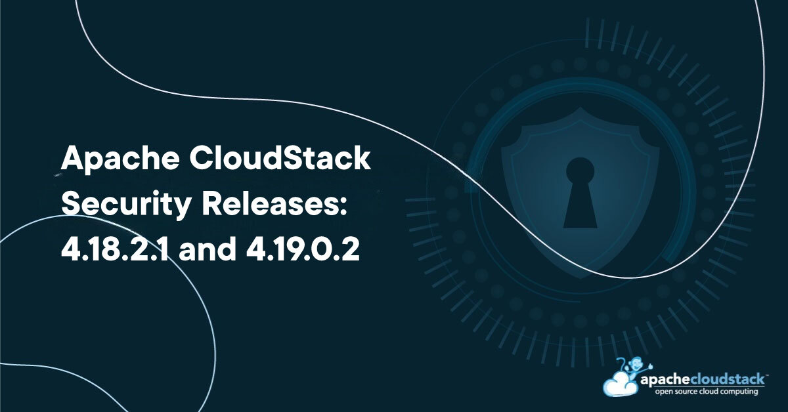

Apache CloudStack project announces the release of LTS security releases
[4.18.2.1](https://github.com/apache/cloudstack/releases/tag/4.18.2.1) and
[4.19.0.2](https://github.com/apache/cloudstack/releases/tag/4.19.0.2) that
addresses CVE-2024-38346 and CVE-2024-39864, both of severity rating
'important', explained below.

<!-- truncate -->

## [CVE-2024-38346](https://www.cve.org/CVERecord?id=CVE-2024-38346): Unauthenticated cluster service port leads to remote execution

The CloudStack cluster service runs on unauthenticated port (default 9090) that
can be misused to run arbitrary commands on targeted hypervisors and CloudStack
management server hosts. Some of these commands were found to have command
injection vulnerabilities that can result in arbitrary code execution via agents
on the hosts that may run as a privileged user. An attacker that can reach the
cluster service on the unauthenticated port (default 9090), can exploit this to
perform remote code execution on CloudStack managed hosts and result in complete
compromise of the confidentiality, integrity, and availability of CloudStack
managed infrastructure.

## [CVE-2024-39864](https://www.cve.org/CVERecord?id=CVE-2024-39864): Integration API service uses dynamic port when disabled

The CloudStack integration API service allows running its unauthenticated API
server (usually on port 8096 when configured and enabled via
integration.api.port global setting) for internal portal integrations and for
testing purposes. By default, the integration API service port is disabled and
is considered disabled when integration.api.port is set to 0 or negative. Due to
an improper initialisation logic, the integration API service would listen on a
random port when its port value is set to 0 (default value). An attacker that
can access the CloudStack management network could scan and find the randomised
integration API service port and exploit it to perform unauthorised
administrative actions and perform remote code execution on CloudStack managed
hosts and result in complete compromise of the confidentiality, integrity, and
availability of CloudStack managed infrastructure.

## Credits

Both the CVEs are credited to the following reporters from the Apple Services
Engineering Security team:

- Adam Pond (finder)
- Terry Thibault (finder)
- Damon Smith (finder)

## Affected versions:

- Apache CloudStack 4.0.0 through 4.18.2.0
- Apache CloudStack 4.19.0.0 through 4.19.0.1

## Resolution

Users are recommended to upgrade to version 4.18.2.1, 4.19.0.2 or later, which
addresses these issues. Additionally, users who cannot upgrade and otherwise
are recommended for following actions:

- Restrict the network access to the cluster service port (default 9090) on a
CloudStack management server host to only its peer CloudStack management server
hosts.

- Restrict the network access on the CloudStack management server hosts to only
essential ports.

## Downloads and Documentation

The official source code for the 4.18.2.1 and 4.19.0.2 releases can be
downloaded from the project downloads page:

https://cloudstack.apache.org/downloads

The 4.18.2.1 and 4.19.0.2 release notes can be found at:
- https://docs.cloudstack.apache.org/en/4.18.2.1/releasenotes/about.html
- https://docs.cloudstack.apache.org/en/4.19.0.2/releasenotes/about.html

In addition to the official source code release, individual contributors
have also made release packages available on the Apache CloudStack
download page, and available at:

- https://download.cloudstack.org/el/7/
- https://download.cloudstack.org/el/8/
- https://download.cloudstack.org/el/9/
- https://download.cloudstack.org/suse/15/
- https://download.cloudstack.org/ubuntu/dists/
- https://www.shapeblue.com/cloudstack-packages/
